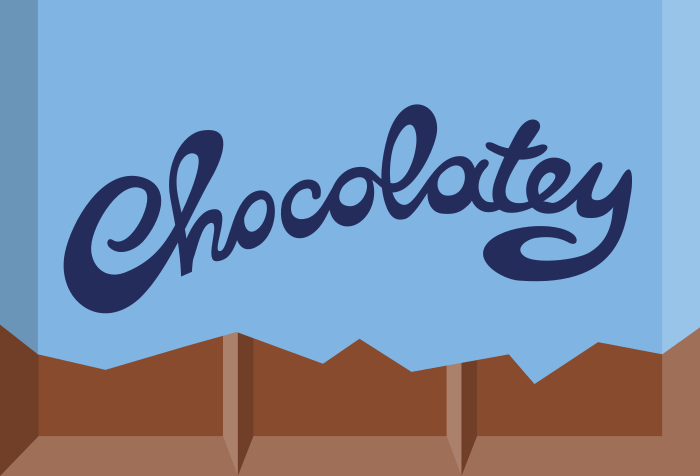

<h2 align="center">Supporting PoshBot</h2>

PoshBot is a MIT-licensed open source project. Ongoing development is made possible thanks to the support of sponsors.
If you'd like to become a sponsor, you can do so through [GitHub Sponsors](https://github.com/users/devblackops/sponsorship) or [Patreon](https://www.patreon.com/bePatron?u=10352866).

<h4 align="center">Silver Sponsors</h4>

<!-- <h2 align="center">Special Sponsors</h2>

<table>
  <tbody>
  </tbody>
</table>

<h2 align="center">Platinum via Patreon</h2>
<table>
  <tbody>
  </tbody>
</table>

<h2 align="center">Gold via Patreon</h2>
<table>
  <tbody>
  </tbody>
</table>

<h2 align="center">Bronze via Patreon</h2>
<table>
  <tbody>
  </tbody>
</table>

<h2 align="center">Generous Backers via Patreon ($50+)</h2>
-->

<h2 align="center">GitHub Sponsors</h2>

- [Francois-Xavier Cat](https://github.com/lazywinadmin)
- [Nate Ferrell](https://github.com/scrthq)

<h2 align="center">Patreon Sponsors</h2>

- Alexander May
- [Chris Gardner](https://github.com/ChrisLGardner)
<!--10 end-->
