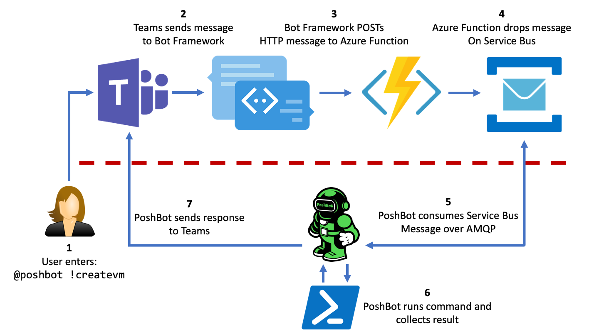
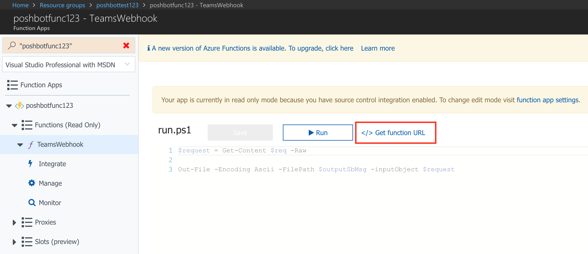
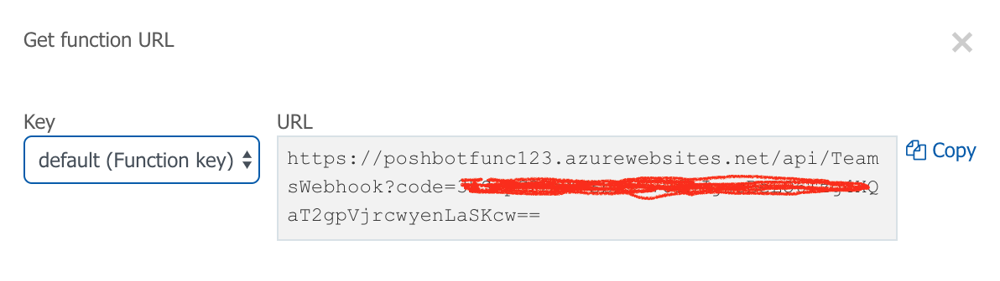
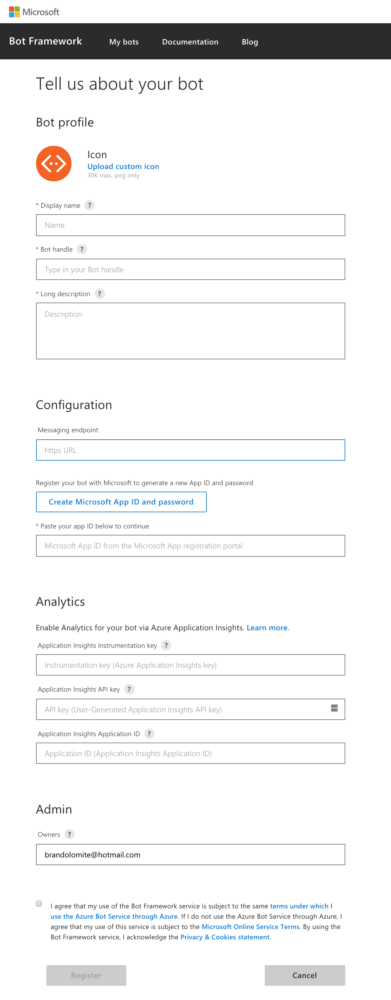
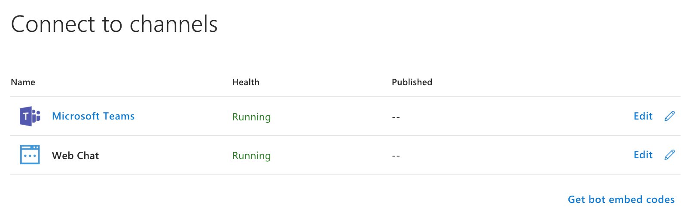
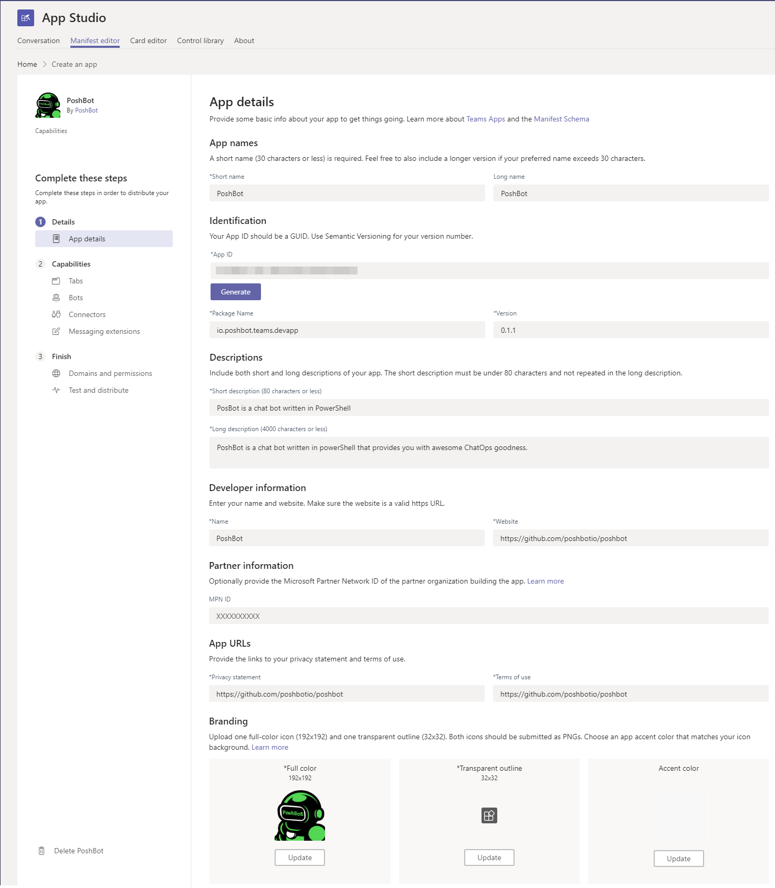
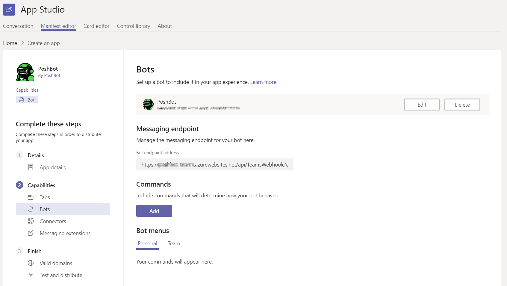
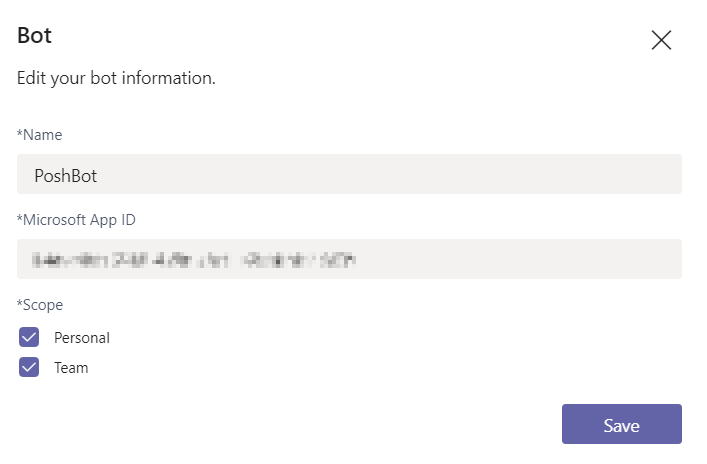
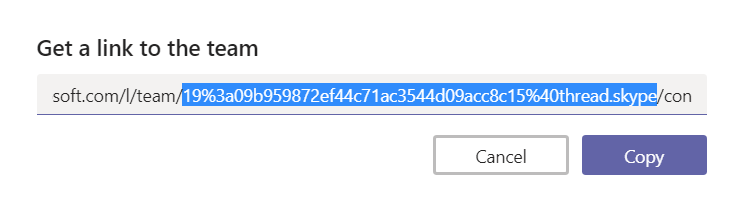

# Setting up Microsoft Teams Backend

Because of the bot architecture in Microsoft Teams, there is a fair amount of work to enable PoshBot to work with it.
When sending a message to a bot in Teams, it expects to be able to POST a JSON payload to a HTTPS endpoint.
To avoid having to expose PoshBot on the internet while at the same time giving it access to your internal network for day-to-day ChatOps activities, an alternate method using an Azure Function and Service Bus is used.

Teams will send messages to an Azure Function which will in turn send the message to a Service Bus queue.
PoshBot can then make an outbound call to the queue to consume the messages.
Bot command responses are then send directly to Teams.
This allows PoshBot to be kept inside the firewall.



The steps to create the necessary Azure resources and wire up Teams to PoshBot is outlined below.

## Azure Login

Log in to your Azure subscription using the [Azure CLI](https://docs.microsoft.com/en-us/cli/azure/install-azure-cli?view=azure-cli-latest).
Make sure you have the correct subscription active.

```
az login
az account set --subscription "<SUBSCRIPTION-NAME>"
```

## Create Resource Group

Create a new resource group in your desired region. This group will contain both the Azure Function and Service Bus resources.

```
az group create --name <RESOURCE-GROUP-NAME> --location <REGION>
```

## Service Bus

Create a new Service Bus namespace in the resource group.
The `Basic` SKU is fine for our purposes.

```
az servicebus namespace create --resource-group <RESOURCE-GROUP-NAME> \
  --name <NAMESPACE-NAME> --location <REGION> --sku Basic
```

The new queue should have the following settings:

| Setting | Value |
|---------|-------|
| Message time to live | 1 minute |
| Lock duration        | 30 seconds |
| Maximum delivery count | 10 |
| Maximum Size | 1GB |
| Partitioning | false |
| Move expired messages to dead-letter queue | true |

```
az servicebus queue create --resource-group <RESOURCE-GROUP-NAME> \
  --namespace-name <NAMESPACE-NAME> --name messages --lock-duration "0:00:30" \
  --default-message-time-to-live "0:01:00" --max-delivery-count 10 \
  --max-size 1024 --enable-partitioning false \
  --enable-dead-lettering-on-message-expiration true
```

Create a new `Shared access policy` called `receive` for the `messages` queue with `Listen` permission.

```
az servicebus queue authorization-rule create --resource-group <RESOURCE-GROUP-NAME> \
  --namespace-name <NAMESPACE-NAME> --queue-name messages --name receive --rights Listen
```

Retrieve the SAS key for the `messages` queue.
This key will be needed in the Teams backend configuration for PoshBot so it can connect to the queue and receive messages.

```
$key = az servicebus queue authorization-rule keys list --resource-group <RESOURCE-GROUP-NAME> \
  --namespace-name <NAMESPACE-NAME> --queue-name messages --name receive --query primaryKey --output tsv
```

Retrieve the root connection string for the namespace.
This will be used by the Azure Function so it can drop messages into the queue when POSTs are received from Bot Framework.

```
$rootConnectionString = az servicebus namespace authorization-rule keys list \
  --resource-group <RESOURCE-GROUP-NAME> --namespace-name <NAMESPACE-NAME> \
  --name RootManageSharedAccessKey --query primaryConnectionString --output tsv
```

## Azure Function

Create a new Azure Function in the resource group.
This Azure Function will receive messages from the Bot Framework and drop the message onto the Service Bus queue.

The source code for the Azure Function is contained in the [TeamsWebhook](https://github.com/poshbotio/TeamsWebhook) GitHub repository.

```
az storage account create --resource-group <RESOURCE-GROUP-NAME> --name <STORAGE-ACCOUNT-NAME> \
  --location <REGION> --sku Standard_LRS

az functionapp create --resource-group <RESOURCE-GROUP-NAME> --name <FUNCTION-APP-NAME> \
  --storage-account <STORAGE-ACCOUNT-NAME> --consumption-plan-location <REGION> \
  --deployment-source-url "https://github.com/poshbotio/TeamsWebhook"
```

Since we're deploying a PowerShell-based Azure Function, we need to ensure we're using **v1** Functions and not **v2**.
This will no longer be needed once **v2** PowerShell Functions are supported.

```
az functionapp config appsettings set --resource-group <RESOURCE-GROUP-NAME> \
  --name <FUNCTION-APP-NAME> --settings FUNCTIONS_EXTENSION_VERSION="~1"
```

Create an application setting for the Service Bus connection string.

```
az functionapp config appsettings set --resource-group <RESOURCE-GROUP-NAME> \
  --name <FUNCTION-APP-NAME> --settings "SB_CONNECTION = $rootConnectionString"
```

Disable the git integration

```
az functionapp deployment source config --resource-group <RESOURCE-GROUP-NAME> \
  --name <FUNCTION-APP-NAME> --repo-url "https://github.com/poshbotio/TeamsWebhook" \
  --manual-integration
```

Make note of the function URL.
Unfortunately, the Azure CLI does not have a command to retrieve the function URL or token.
To do that, log into the Azure portal and retrieve it there.





## Create a Bot in Bot Framework

Navigate to the URL below in order to create a new bot in Bot Framework.

[https://dev.botframework.com/bots/new](https://dev.botframework.com/bots/new)

Note that the **bot handle** is globally unique and can not be changed later.
Copy this value down as it will be needed by the Teams backend in PoshBot.

For **Messaging endpoint**, enter the Azure Function URL you created earlier.

> Make sure the URL includes the function token so Bot Framework is making authenticated calls to your function.

Make sure to create a new **App ID** and **password** and record these values.
They will also be need by the Teams backend in PoshBot.



Once the bot has been created, you'll need to add Teams as an available channel.
Select Teams from the list of available channels and accept the Terms of Service.

Once added, you should see both Microsoft Teams and Web Chat as connected channels.



## Test Bot Framework

At this point you can test that Bot Framework, the Azure Function, and Service Bus queue are setup correctly by using the **test pane** in the Bot Framework portal.

* Click on `Test` in the top right to open up the test pane

* Send a sample message

* Verify that the Azure Function received the message by looking at function logs

* Verify that the message was then submitted to Service Bus queue by inspecting the number of items in the queue from the Azure Portal.
  You can also use the [Service Bus Explorer](https://github.com/paolosalvatori/ServiceBusExplorer) to look at the messages.

## Install App Studio in Teams

You'll need to create a new bot in Microsoft Teams and the easies way to do that is with the [App Studio](https://docs.microsoft.com/en-us/microsoftteams/platform/get-started/get-started-app-studio).
Download and install the App Studio into Teams and follow the guide to creating the bot manifest.

## Create a Bot Manifest using App Studio



Navigate to `Capabilities -> Bots` and enter the `App ID` you created in Bot Framework.
The messaging endpoint should update to reflect the URL to your Azure Function.



Edit the bot settings and ensure `Personal` and `Team` are selected under `Scope`.



Export the bot manifest to a `.zip` files on your computer.

## Sideload the Bot Manifest in Teams

In Teams, go to `Teams -> Manage Team`. Go to the **Apps** tab and select `Upload a custom app`. Select the manifest **.zip** you just downloaded.

## Determine Your Teams ID

PoshBot also needs to know your Teams ID so it can query it for the user roster.
Without this, PoshBot cannot resolve User Principal Names to IDs and vice versa.

To get your Teams ID, go to `Teams -> Get link to team`, and copy the ID.
It will have `thread.skype` at the end.
This ID is URL encoded so run the following PowerShell command to decode it.



```powershell
[System.Web.HttpUtility]::UrlDecode('<YOUR-ENCODED-TEAMS-ID>')
```

## Create PoshBot Startup Script

The following example script shows how to create a new Teams backend using the values created above.

> Note that with the Teams backend, Azure Active Directory User Principle Names are used when defining the list of bot admins.

```powershell
Import-Module PoshBot
$pbc = New-PoshBotConfiguration
$pbc.BotAdmins = @('<AAD-USER-PRINCIPAL-NAME>')

$backendConfig = @{
    Name                = 'TeamsBackend'
    BotName             = '<BOT-NAME>'
    TeamId              = '<TEAMS-ID>'
    ServiceBusNamespace = '<SERVICE-BUS-NAMESPACE-NAME>'
    QueueName           = 'messages'
    AccessKeyName       = 'receive'
    AccessKey           = '<SAS-KEY>' | ConvertTo-SecureString -AsPlainText -Force
    Credential          = [pscredential]::new(
        '<BOT-APP-ID>',
        ('<BOT-APP-PASSWORD>' | ConvertTo-SecureString -AsPlainText -Force)
    )
}
$backend = New-PoshBotTeamsBackend -Configuration $backendConfig
```

## Start PoshBot

Once the backend has been created, create a new instance of PoshBot and start it.

```powershell
$bot = New-PoshBotInstance -Configuration $pbc -Backend $backend
$bot | Start-PoshBot -Verbose
```
