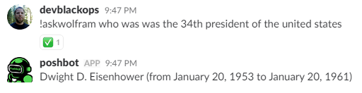

# Config-Provided Parameters

Some commands within PoshBot plugins may require a credential or secret of sometime kind in order to operate properly.
This could be an api key to access a REST API or a credential to access a remote system.
You can of course hard code values into your plugin, but it would not be portable and you certainly **should not publish a plugin to the outside world with secrets inside**.

To solve this, PoshBot supports dynamically inserting values into command parameters at runtime.
These values are stored in your bot configuration and with just a small change to your plugin commands, can be made available on request.

Consider the following simple example from the [PoshBot.Wolfram](https://github.com/poshbotio/PoshBot.Wolfram) plugin.
You have a command that needs to query a remote API but must use an API key to do so.
This function has a **mandatory** parameter called `ApiKey`.
This is obviously a secret and should not be baked into the plugin and distributed to the world.
To tell PoshBot to retrieve this value for us, we use the `[PoshBot.FromConfig()]` custom attribute and attach it to the parameter we want to resolve a value for.
When PoshBot executes this function, it will resolve the needed value from the bot configuration and pass it to the command as a named parameter just like you would if you ran this function manually from a console window.

```powershell
function Invoke-WolframQuery {
    <#
    .SYNOPSIS
        Asks WolframAlpha a question
    .EXAMPLE
        !askwolfram '34th president of the united states'
    #>
    [PoshBot.BotCommand(CommandName = 'askwolfram')]
    [cmdletbinding()]
    param(
        [PoshBot.FromConfig('ApiKey')]
        [parameter(Mandatory)]
        [string]$ApiKey,

        [parameter(ValueFromRemainingArguments = $true)]
        [string[]]$Arguments
    )

    $q = $Arguments -join ' '
    $url = "http://api.wolframalpha.com/v1/result?i=$q&appid=$ApiKey"
    $r = Invoke-RestMethod -Uri $url
    Write-Output $r
}
```



> Notice that we didn't need to specify the `ApiKey` parameter.

## Bot Configuration

You store the values you wish to dynamically provide to your plugins inside the `PluginConfiguration` property of the main [bot configuration](../../../guides/configuration.md).
`PluginConfiguration` is a `[hashtable]` where each key is the name of a plugin.
The value of that key will be another hashtable with each subkey matching a parameter name in one or more commands of that plugin. You can have as many items in each plugins' hashtable entry as needed.

##### config.psd1
```powershell
@{
    #
    # Other properties omitted for brevity
    #
    PluginConfiguration = @{
        'PoshBot.Wolfram' = @{
            ApiKey = 'xxxxxxxx'
        }
    }
}
```

> When using the `[PoshBot.FromConfig()]` attribute, PoshBot will only resolve values from that plugin's section of the bot configuration. **You will not be able to access items contained in another plugins configuration section**.

By default, the `[Poshbot.FromConfig()]` attribute will look for a key in the plugin configuration that matches the name of the parameter. You can override this by specifying another name with `[PoshBot.FromConfig('<foo>')]`.

For example, if the parameter name is `ApiKey` but we want to retrieve the value of `MySharedKey` in the plugin configuration, our function and plugin configuration would like this:

```powershell
function Foo {
    [cmdletbinding()]
    param(
        [PoshBot.FromConfig('MySharedKey')]
        [string]$ApiKey
    )
    ...
}
```

##### config.psd1
```powershell
@{
    #
    # Other properties omitted for brevity
    #
    PluginConfiguration = @{
        'MyPlugin' = @{
            MySharedKey = 'xxxxxxxx'
        }
    }
}
```

## PSCredentials in Plugin Configuration

It is possible to store values of type `PSCredential` and `SecureString` inside the bot configuration.
Internally, PoshBot serializes these values encrypted to disk.
Only the user who exported the configuration to disk, can import it.

Here is an example of creating a new bot configuration object, creating a plugin configuration section that contains a `PSCredential`, then saving the object back to the filesystem.

```powershell
$myCred = Get-Credential
$pbc = New-PoshBotConfiguration
$pbc.PluginConfiguration = @{
    MyPlugin = @{
        Credential = $myCred
    }
}
$pbc | Save-PoshBotConfiguration -Path ~/.poshbot/bot.psd1
```

If you inspect `~/.poshbot/bot.psd1` you'll see it resemble the following:

```powershell
@{
  PluginRepository = @('PSGallery')
  AlternateCommandPrefixSeperators = @(':',',',';')
  ModuleManifestsToLoad = @()
  LogDirectory = 'C:\Users\brandon\.poshbot'
  Name = 'PoshBot'
  BotAdmins = @()
  CommandHistoryMaxLogSizeMB = 10
  LogLevel = 'Verbose'
  SendCommandResponseToPrivate = @()
  MaxLogsToKeep = 5
  ConfigurationDirectory = 'C:\Users\brandon\.poshbot'
  AddCommandReactions = $True
  CommandHistoryMaxLogsToKeep = 5
  MaxLogSizeMB = 10
  PluginDirectory = 'C:\Users\brandon\.poshbot'
  MuteUnknownCommand = $False
  PluginConfiguration = @{
    MyPlugin = @{
      Credential = (PSCredential "joeuser" "01000000d08c9ddf0115d1118c7a00c04fc297eb01000000c7691b32ad11ac4da157633d8146f661000000000200000000001066000000010000200000007b8b554e63146f4ee263df58152d88b755f7008acaeacefaf98279d289e0950e000000000e80000000020000200000006e6bf3e38c8f5945b2a5d6dcb388f6310363c3674f894e8f090e11c52ad4855b10000000a68fc697c739cfd6421c65700de2173b40000000968bf20bfbef68a6efea6612b192767c74a9ac1fbe96ba247471d4c32665af1f4a290be367984d396f248396ecc0a2a513052b3ce9130280be0eaa4cc0126e16")
    }
  }
  AlternateCommandPrefixes = @('poshbot')
  CommandPrefix = '!'
  BackendConfiguration = @{

  }
  LogCommandHistory = $True
}
```
