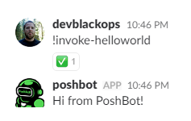
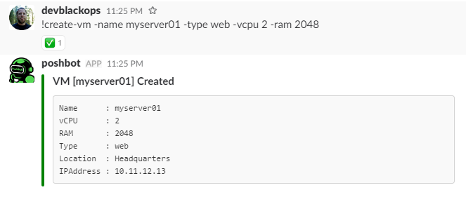
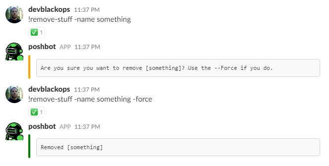

# Custom Responses

PoshBot reads the output stream of a command and sends the text back to the chat network for display.
Without any modification, given the simple PoshBot command below would like like:

```powershell
function Invoke-HelloWorld {
    Write-Output 'Hi from PoshBot!'
}
```



That is good enough for many things, but sometimes you'll want more control over the output of your command.

Some chat clients (Slack for example) allow richer display options such as [cards](https://api.slack.com/docs/message-attachments) which can include titles, images, thumbnails, tables, footers, etc.
To enable custom formatting of your command's response, PoshBot includes a couple public functions exposed from the module.

* New-PoshBotCardResponse
* New-PoshBotTextResponse
* New-PoshBotFileUpload

> Note that by using these custom response functions, you are creating a dependency between your module and PoshBot.
**This requires that you set `RequiredModules = 'PoshBot'` in your module manifest.**

## Text Responses

You can use `New-PoshBotTextResponse` in lieu of `Write-Output` in your command to customize how PoshBot displays text.
`New-PoshBotTextResponse` has the following parameters to control the display of simple text.

| Parameter Name | Type   | Required | Description |
|----------------|--------|----------|-------------|
| Text           | string | true     | The text to display
| AsCode         | switch | false    | Format the text in a code block if the backend supports it
| DM             | switch | false    | Tell PoshBot to redirect the response to a DM channel

### Examples

This example is equivalent to using `Write-Output`.
```powershell
function Invoke-HelloWorld {
    New-PoshBotTextResponse -Text 'Hello world!'
}
```

If the chat backend supports it, this will format the text in a code block like `this`.

```powershell
function Invoke-HelloWorld {
    New-PoshBotTextResponse -Text 'Hello world!' -AsCode
}
```

If the chat backend supports it, this will return the command response back to the user in the form of a direct message rather than to the public channel where the command was invoked.
This is useful for commands that might return sensitive information.

```powershell
function Invoke-HelloWorld {
    New-PoshBotTextResponse -Text 'Hello world!' -DM
}
```

## Cards

Cards are responses that include rich data such as images, tables, links, etc.
To send a card response back to the chat network, you can use `New-PoshBotCardResponse`.
This function has the following parameters.

| Parameter Name | Type   | Required | Description |
|----------------|--------|----------|-------------|
| Text           | string | true     | The text to display
| Type           | string | false    | Specifies a preset color (green, yello, red) for the card response. This is useful to designate success, warning or failure.
| DM             | switch | false    | Tell PoshBot to redirect the response to a DM channel
| Title          | string | false    | The title of the response. This will be the card title in chat networks like Slack
| ThumbnailUrl   | string | false    | A URL to a thumbnail image to display in the card response
| ImageUrl       | string | false    | A URL to an image to display in the card response
| LinkUrl        | string | false    | Will turn the title into a hyperlink
| Color          | string | false    | The hex color code to use for the card response. In Slack, this will be the color of the left border in the message attachment
| Fields       | string | false    | A hashtable to display as a table in the card response

### Examples

```powershell
function Create-VM {
    <#
    .SYNOPSIS
        Creates a new VM
    .EXAMPLE
        !create-vm --name server01 -vcpu 2 -ram 1024
    #>
    [cmdletbinding()]
    param(
        [string]$Name = (new-guid).ToString().split('-')[4],
        [string]$Type = 'web',
        [int]$vCPU = 1,
        [int]$RAM = 1024
    )

    $r = [pscustomobject]@{
        Name = $Name
        vCPU = $vCPU
        RAM = $RAM
        Type = $Type
        Location = 'Headquarters'
        IPAddress = '10.11.12.13'
    }

    New-PoshBotCardResponse -Title "VM [$Name] Created" -Text ($r | Format-List -Property * | Out-String)
}
```



```powershell
function Remove-Stuff {
    <#
    .SYNOPSIS
        Test switch parameters
    .EXAMPLE
        !get-switches --force
    #>
    [cmdletbinding()]
    param(
        [parameter(Mandatory, position = 0)]
        [string[]]$Name,

        [switch]$Force
    )

    if (-not $Force) {
        New-PoshBotCardResponse -Type Warning -Text "Are you sure you want to remove [$($Name -join ',')]? Use the --Force if you do."
    } else {
        $msg = @()
        foreach ($item in $Name) {
            $msg += "Removed [$item]"
        }
        New-PoshBotCardResponse -Type Normal -Text ($msg | Format-List | Out-String)
    }
}
```



## File Uploads

Some command might return a lot of data and sending back a simple spreadsheet or other type of attachment might make more sense than simple text.
To upload attachments, you can use the `New-PoshBotFileUpload` function.
This function has the following parameters.

| Parameter Name | Type     | Required | Description |
|----------------|----------|----------|-------------|
| Path           | string[] | true    | The path(s) to one or more files to upload
| Title          | string   | false    | The title for the uploaded file
| DM             | switch   | false    | Tell PoshBot to redirect the response to a DM channel

```powershell
function Get-ProcessChart {
    <#
    .SYNOPSIS
        Get Excel file of process memory usage by company
    .EXAMPLE
        !get-processchart
    #>
    [cmdletbinding()]
    param()

    Import-Module ImportExcel -ErrorAction Stop

    $file = Join-Path -Path $env:TEMP -ChildPath "$((New-Guid).ToString()).xlsx"

    Get-Process |
        Where-Object {$_.company} |
        Sort-Object -Property PagedMemorySize -Descending |
        Select-Object -Property Company, PagedMemorySize, PeakPagedMemorySize|
        Export-Excel -Path $file `
            -AutoSize `
            -IncludePivotTable `
            -IncludePivotChart `
            -ChartType ColumnClustered `
            -PivotRows Company `
            -PivotData @{PagedMemorySize='sum'; PeakPagedMemorySize='sum'}

    New-PoshBotFileUpload -Path $file -Title 'ProcessMemoryUsageByCompany.xlsx'
}
```


