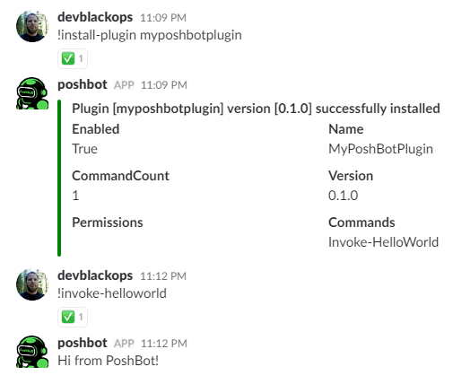

# Developing Plugins

Creating plugins for PoshBot is a pretty straightforward process.
Plugins are really just PowerShell modules with a different name and at the bare minimum, contain a `.psd1` and `.psm1` file.
If you choose, you can create a more flushed out module using current best practices such as one file per function (command), public/private folders, AppVeyor tests, etc.
You can start [here](http://ramblingcookiemonster.github.io/Building-A-PowerShell-Module/) for details on that.

## Create the Plugin (module)

Let's create the PowerShell module folder and the `.psd1` and `.psm1` files. We'll create this module directly in your PowerShell module directory so we can load it in Poshbot easier later. In a production environment, you will probably want to publish these plugins to a repository like the PowerShell Gallery. PoshBot will then install these via [PowerShellGet](https://github.com/PowerShell/PowerShellGet).

```
PS> cd ~\Documents\WindowsPowerShell\Modules
PS> mkdir MyPoshBotPlugin
PS> cd MyPoshBotPlugin
PS> $params = @{
    Path = '.\MyPoshBotPlugin.psd1'
    RootModule = '.\MyPoshBotPlugin.psm1'
    ModuleVersion = '0.1.0'
    Guid = New-Guid
    Author = '<your name>'
    Description = 'My first PoshBot plugin'
}
PS> New-ModuleManifest @params
PS> New-Item MyPoshBotPlugin.psm1
```

## Create our First PoshBot Command

Open `MyPoshBotPlugin.psm1` and save it with the following contents:

```powershell
function Invoke-HelloWorld {
    Write-Output 'Hi from PoshBot!'
}
```

> Remember that PoshBot only imports **public** functions/cmdlets from your module. If you have private functions, PoshBot will not see them as they are not visible via `Get-Command -Module <yourmodule>`.

## Import the Plugin into PoshBot

Hop over to Slack and install the plugin with:

```
!install-plugin MyPoshBotPlugin
```



That's it! You've created and installed your first PoshBot plugin. When running `install-plugin`, PoshBot will first check for the PowerShell module in your `$env:PSModulePath`. If no module is found, it will install the module from the PowerShell Gallery or another PowerShell repository that you have set in your [bot configuration](../../guides/configuration.md)

Check out [Advanced Plugin Developement](./advanced/overview.md) for the really cool stuff you can do with plugins.
